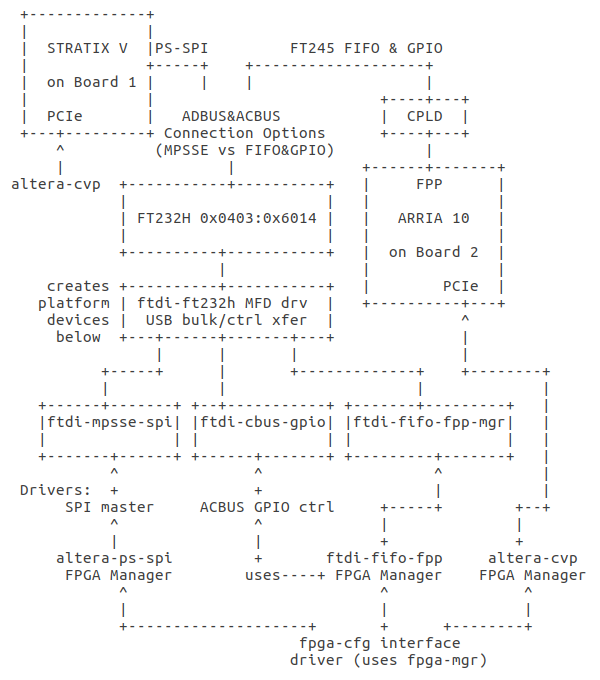
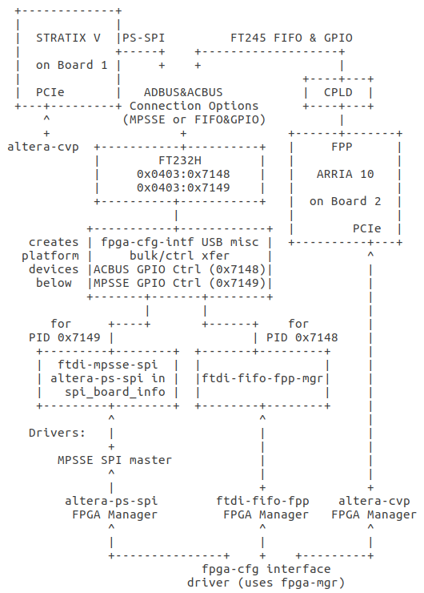

## fpga-cfg FPGA Manager interface driver

### FPGA devices and FPGA configuration adapter hardware
Currently we use two FT232H based FPGA configuration adapter types. The first adapter type utilizes FT232H in MPSEE mode to connect ADBUS SPI/GPIO pins to Stratix-V PS-SPI interface. Another adapter type connects FT232H ADBUS (in FT245 FIFO mode) and two ACBUS GPIOs to the CPLD, the CPLD is connected to the Arria-10 FPP interface. Both FPGAs are connected to the host via PCIe.

### Required low-level FPGA manager and platform drivers
Figure 1 shows a summary with simplified device connection diagram and low-level and configuration interface drivers relationship. The *fpga-cfg* driver provides sysfs based configuration interface for custom FTDI FT232H based adapters for initial configuration of Stratix-V and Altera-10 FPGAs via PS-SPI or FPP interfaces.
The driver uses various low-level drivers for Linux FPGA Manager framework (fpga-mgr). The required out-of-tree low-level fpga-mgr drivers can be found [here](https://lkml.org/lkml/2017/7/6/710 "submitted patch series"), (or as separate patches: [1](https://patchwork.kernel.org/patch/9828985/mbox "patch1"), [2](https://patchwork.kernel.org/patch/9828981/mbox "patch2"), [3](https://patchwork.kernel.org/patch/9828983/mbox "patch3")). Additional patch [4](https://patchwork.kernel.org/patch/9828565/mbox "patch4") for FPGA manager framework is required for *fpga-cfg* driver to build and work as expected. Other low-level drivers as *altera-cvp* and *altera-ps-spi* are in mainline kernel (enable CONFIG_FPGA_MGR_ALTERA_CVP and CONFIG_FPGA_MGR_ALTERA_PS_SPI options).

Figure 1: FT232H, FPGA Devices and Drivers Relationship

</b>  

Some remarks about drivers in above diagram

 * the MFD driver *ftdi-ft232h* binds to FT232H devices and creates CBUS-GPIO (*ftdi-cbus-gpio*), FIFO-FPP FPGA-Manager (*ftdi-fifo-fpp-mgr*) and MPSSE (*ftdi-mpsse-spi*) platform devices for each FT232H device. *ftdi-ft232h* driver provides common functions used in drivers for created platform devices

 * *ftdi-fifo-fpp* FPGA Manager driver attaches to *ftdi-fifo-fpp-mgr* platform devices and registers Linux fpga-mgr interface for each platform device

 * *ftdi-cbus-gpio* platform driver connects to the *ftdi-cbus-gpio* platform devices and registers the ACBUS GPIO controllers used in the *ftdi-fifo-fpp* FPGA Manager driver (for setting the CPLD modes and reading the Arria-10 FPGA configuration status from CPLD)

 * *ftdi-spi* SPI master platform driver connects to the *ftdi-mpsse-spi* platform devices and registers an SPI master controller for FT232H USB-SPI bus. In our adapter hardware this bus has only one SPI slave device - PS-SPI proxy. Thus, the *ftdi-spi* platform driver instantiates one new *altera-ps-spi* SPI device using *struct spi_board_info*, so that the *altera-ps-spi* driver can probe and connect to it. *altera-ps-spi* driver requires some control/status GPIOs. On the adapter hardware these GPIOs are some ADBUS pins controlled in MPSSE mode. Therefore, the driver must additionally register appropriate GPIO controller and install suitable GPIO lookup tables for *altera-ps-spi* SPI devices. *ftdi-spi* driver was not included in the patch series mentioned above as it hasn't yet been tested on the adapter hardware

 * *fpga-cfg* driver takes configuration description via sysfs interface and performs initial FPGA configuration with small periphery image. Afterwards the FPGA PCIe device appears on the PCI bus, *altera-cvp* driver is loaded and CvP FPGA manager is registered with the fpga-mgr framework. Subsequently the *fpga-cfg* driver uses the CvP FPGA manager to configure the FPGA with the core image and unbinds the *altera-cvp* driver after successful CvP configuration (so that a device-specific driver can be attached to the configured PCIe FPGA device). New configuration with periphery and core images is required after suspend/resume cycle because the FPGA power will be switched off while suspend

### Rework of FT232H FPGA configuration adapter drivers for mainlining

Among other things the above sections describe the current state of the low-level USB-SPI/FIFO-FPP FPGA manager drivers for configuration adapter hardware. These drivers are not yet ready to be accepted in mainline kernel. *fpga-cfg* is only a special interface driver an should remain out-of-tree. The drivers for FPGA configuration adapter hardware (*ftdi-ft232h* and platform drivers *ftdi-fifo-fpp*, *ftdi-cbus-gpio*, *ftdi-spi*) should be reworked as there are some fundamental problems pointed out while patch review on the FPGA and USB mailing lists. First problem is that the FT232H VID/PID is already used for various FT232H based USB serial adapters. Retrieving the current operation mode from FTDI EEPROM to enforce selective binding of serial adapters in UART mode in *ftdi_sio* turns out to be too restrictive because *ftdi_sio* is also used in asynchronous FIFO mode. Further, the MPSSE and FT245 FIFO modes are mutually exclusive, so using MFD is not the right fit here. Also the *ftdi-fifo-fpp-mgr* driver is very card specific for generic chip like FT232H.

The draft below suggests a way to rework and improve the low-level FPGA manager drivers for our FT232H based adapter variants to prepare them for inclusion in mainline kernel tree. In reworked drivers we will use different custom PIDs for our two adapter types (USB-SPI, USB-FIFO-FPP). We have already reserved custom PIDs for both adapter types and can use them in adapter EEPROMs to ensure binding to the vendor specific drivers for USB-SPI and USB-FIFO-FPP FPGA configuration adapters. It would be worthwhile to concentrate the common USB transfer related functions (bulk, control and FTDI mode setting code as used in previous *ftdi-ft232h* driver part) in a single file and reuse them in USB-SPI master and USB-FIFO-FPP drivers to avoid code duplication. These functions could be passed to platform drivers as callbacks in an ops struct via platform data.

Instead of MFD part as in previous version I intend to add an USB misc driver for our FPGA configuration adapters under drivers/usb/misc/. When probing for VID/PID assigned to FIFO-FPP adapter type, this driver will register CBUS GPIO controller, GPIO lookup tables for FIFO FPP device and will create a platform device for attaching the low-level FPGA manager driver for FIFO FPP interface. The attached FPGA manager driver will be similar to the *ftdi-fifo-fpp* driver and will reside in drivers/fpga/. When probing for VID/PID assigned to USB-SPI adapter type, the USB misc driver will register MPSSE GPIO controller, GPIO lookup tables for *altera-ps-spi* control/status GPIOs and will create platform device for attaching MPSSE SPI master controller driver. The SPI master controller platform driver will register MPSSE SPI bus with SPI slave device from *spi_board_info* struct in its platform data (in our case PS-SPI slave device for attaching *altera-ps-spi* driver). The intended location of this custom SPI master controller driver is drivers/spi/. Figure 2 below shows a simplified diagram when using reworked FT232H low-level configuration interface drivers.

Figure 2: FT232H, FPGA Devices and intended Drivers Relationship

</b>  

